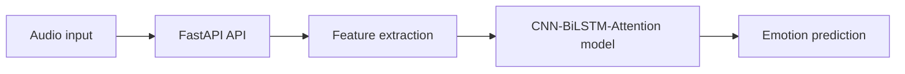

# Emotion Recognition from Speech

> A portfolio-grade system branded as EmoVoice

[](https://www.python.org/)
[](https://fastapi.tiangolo.com/)
[](https://opensource.org/licenses/MIT)

**EmoVoice** is a speech emotion recognition portfolio project that converts short audio input into predicted emotions with confidence scores. It combines deterministic audio preprocessing, a CNN-BiLSTM-Attention model, and a FastAPI inference API for demonstration and experimentation.

## Project highlights

- End-to-end speech audio processing pipeline
- CNN-BiLSTM-Attention deep learning model
- FastAPI-based prediction API
- Clear, modular code structure for portfolio presentation
- Built with Python 3.10+, PyTorch, Librosa, and FastAPI

## Architecture



## Tech stack

| Technology | Purpose |
| --- | --- |
| Python 3.10+ | Core application logic |
| Librosa + SoundFile | Audio loading and preprocessing |
| NumPy | Numerical feature processing |
| PyTorch | Deep learning model |
| scikit-learn | Dataset splitting and evaluation utilities |
| FastAPI | API layer |
| Uvicorn | ASGI server |
| pytest + flake8 | Local validation |
| Docker + Compose | Containerized setup |

## Getting started

### 1. Clone the repository

```bash
git clone https://github.com/ayeshafarhath/speech-emotion-recognition.git
cd speech-emotion-recognition
```

### 2. Create a virtual environment

```bash
python -m venv .venv
source .venv/bin/activate
```

### 3. Install dependencies

```bash
pip install -r requirements.txt
```

### 4. Train the model

```bash
python -m src.training.train --data-dir data/raw --output models/cnn_lstm.pt
```

### 5. Run local inference

```bash
python -m src.inference.predict --input sample.wav
```

### 6. Start the API

```bash
uvicorn api.main:app --host 0.0.0.0 --port 8000
```

Open the API docs at: http://localhost:8000/docs

## Testing
Run locally:
flake8 src api --max-line-length=120
pytest tests/ -v

## License

MIT License - Copyright (c) 2026 Ayesha Farhath.
