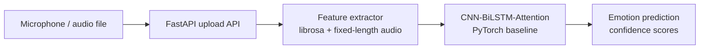

# Emotion Recognition from Speech

> A portfolio-grade system branded as EmoVoice

[](https://www.python.org/)
[](https://fastapi.tiangolo.com/)
[](https://opensource.org/licenses/MIT)

**EmoVoice** is a speech-emotion-recognition portfolio project that turns a short audio recording into a predicted emotion with per-class confidence scores. It combines deterministic audio preprocessing, a compact CNN-BiLSTM-Attention baseline, and a documented HTTP API for experimentation and demonstration.

> **Project status:** This is a baseline implementation for engineering demonstration and experimentation. No accuracy claim is made until the model is trained and evaluated on a documented, appropriately licensed dataset.

## Architecture



## Tech stack

| Technology | Why it is used |
| --- | --- |
| Python 3.10+ | Broad ecosystem support and readable ML application code |
| Librosa + SoundFile | Audio loading, resampling, normalization, and acoustic feature extraction |
| NumPy | Efficient numerical arrays and deterministic feature preprocessing |
| PyTorch | Flexible implementation of the CNN-BiLSTM-Attention classifier |
| scikit-learn | Stratified dataset splitting and reproducible evaluation utilities |
| FastAPI | Typed, documented HTTP inference API with low integration overhead |
| Uvicorn | Production-oriented ASGI server for the API |
| pytest + flake8 | Automated regression tests and code-quality checks |
| Docker + Compose | Reproducible runtime packaging and simple local deployment |
| GitHub Actions | Continuous linting, testing, and container-build validation |

## Features

- Fixed-length mono audio preprocessing at 16 kHz by default
- MFCC, delta-MFCC, chroma, mel-spectrogram, spectral contrast, zero-crossing-rate, and RMS features
- CNN-BiLSTM-Attention baseline implemented in PyTorch
- Reproducible training with seeded splits, class-weighted loss, early stopping, and checkpoint metadata
- CLI inference with confidence scores and measured processing time
- FastAPI endpoints for health checks and uploaded-audio prediction
- Upload validation, size limits, temporary-file cleanup, and configurable model paths
- Docker and Docker Compose support
- Unit and API contract tests

## Getting started

### 1. Clone and install

```bash
git clone https://github.com/ayeshafarhath/speech-emotion-recognition.git
cd speech-emotion-recognition
python -m venv .venv
# Linux/macOS
source .venv/bin/activate
# Windows PowerShell: .venv\Scripts\Activate.ps1
pip install -r requirements.txt
```

The audio stack may also require system packages such as `libsndfile1` and `ffmpeg`. The provided Docker image installs them automatically.

### 2. Prepare data

Training expects one directory per emotion label:

```text
data/raw/
├── angry/
│   ├── example-01.wav
│   └── example-02.wav
├── happy/
│   └── example-03.wav
└── neutral/
    └── example-04.wav
```

Use audio you are permitted to process. Dataset licensing and speaker-independent splitting matter when reporting results.

### 3. Train a checkpoint

```bash
python -m src.training.train \
  --data-dir data/raw \
  --output models/cnn_lstm.pt
```

The training command extracts features, creates stratified partitions, trains the baseline, and saves the model plus the class names and preprocessing configuration to `models/cnn_lstm.pt`.

### 4. Run local inference

```bash
python -m src.inference.predict --input sample.wav
```

### 5. Start the API

```bash
uvicorn api.main:app --host 0.0.0.0 --port 8000
```

Open the interactive documentation at [http://localhost:8000/docs](http://localhost:8000/docs).

### Docker

```bash
docker compose up --build
```

Place the trained checkpoint at `models/cnn_lstm.pt`; Compose mounts `./models` into the container. Optional environment variables include `MODEL_CHECKPOINT`, `CORS_ORIGINS`, `HOST`, and `PORT`.

## API

| Method | Endpoint | Description | Response |
| --- | --- | --- | --- |
| `GET` | `/health` | Checks service availability and whether the configured checkpoint exists | `status`, `model_available`, `checkpoint` |
| `POST` | `/predict` | Accepts a multipart form upload named `file` (`.wav`, `.flac`, `.mp3`, `.ogg`, or `.m4a`) | `emotion`, `confidence_scores`, `processing_time_ms` |

Example request:

```bash
curl -X POST http://localhost:8000/predict \
  -F "file=@sample.wav"
```

Example response shape:

```json
{
  "emotion": "happy",
  "confidence_scores": {
    "angry": 0.12,
    "happy": 0.71,
    "neutral": 0.17
  },
  "processing_time_ms": 42.8
}
```

The values above are illustrative response-shape examples, not measured project results.

## Testing
Run locally:
flake8 src api --max-line-length=120
pytest tests/ -v

## Limitations

- This is a baseline portfolio implementation, not a clinically or commercially validated emotion-recognition system.
- No accuracy, F1, latency, or generalization number is claimed here. Results depend on the dataset, label definitions, preprocessing, split strategy, and hardware.
- A useful evaluation requires a documented and appropriately licensed dataset such as RAVDESS, with its license respected and speaker-independent evaluation where appropriate.
- Emotions are subjective and culturally dependent; acted datasets may not represent spontaneous real-world speech.
- The model expects the same preprocessing configuration used during training and is sensitive to recording conditions, language, accents, background noise, and class imbalance.
- Confidence scores are model probabilities, not calibrated certainty or psychological assessment.
- The current service is intentionally small and does not include authentication, rate limiting, persistent request storage, or observability infrastructure.

## Future roadmap

- Add a documented dataset-preparation workflow with license and provenance notes
- Add speaker-independent cross-validation and reproducible evaluation reports
- Compare against transparent baselines and calibrate confidence scores
- Improve temporal modeling by retaining frame-level feature sequences rather than relying on summarized vectors
- Add augmentation experiments, noise robustness checks, and class-imbalance analysis
- Add API authentication, rate limiting, structured logging, and metrics
- Add batch inference and a lightweight web demo
- Publish model cards describing intended use, limitations, and ethical considerations

## License
MIT License - Copyright (c) 2026 Ayesha Farhath. This is an original implementation for academic portfolio purposes. Built as a baseline engineering demonstration and not a clinically validated system.
